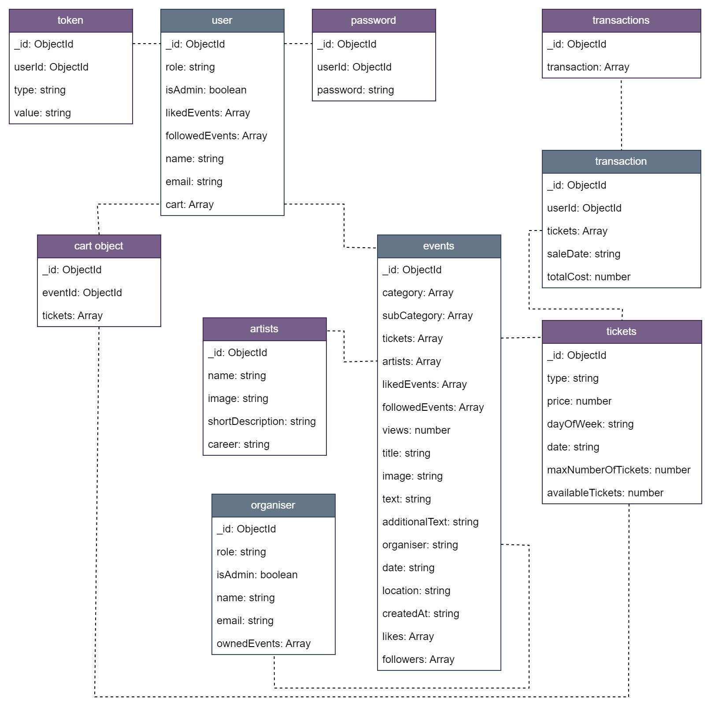
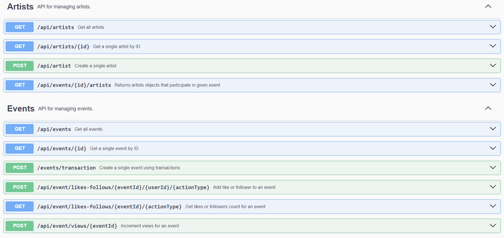
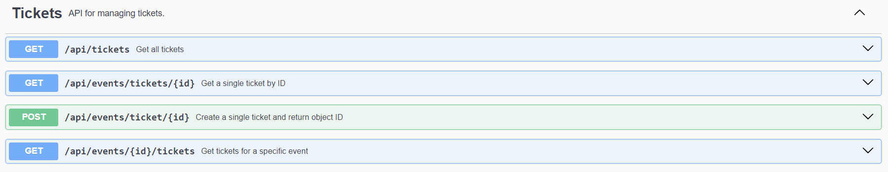
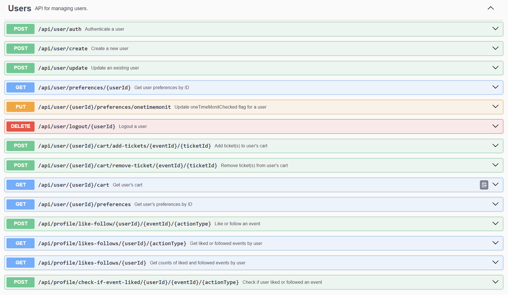
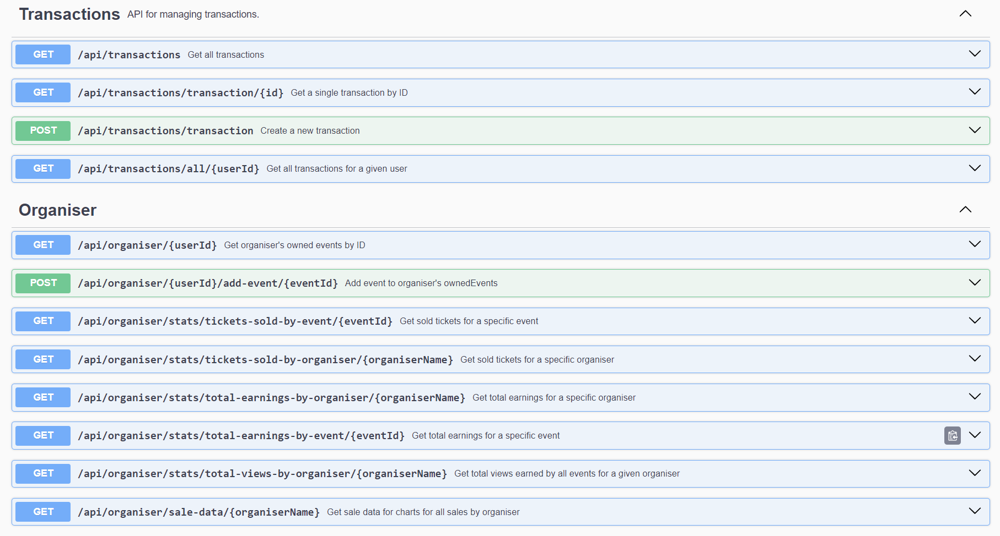
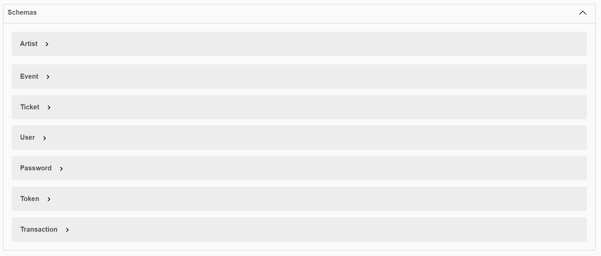

# Nazwa przedmiotu
Technologie aplikacji webowych II

***

# Autor
Marcin Król

***

# Temat projektu
System sprzedaży biletów na różne typy wydarzeń.

***

# Opis projektu
Aplikacja webowa umożliwi użytkownikom przeglądanie i wyszukiwanie dostępnych wydarzeń, a także wybieranie najlepszych miejsc w sali na podstawie „schematu” miejsc. Po wybraniu biletów, użytkownicy mogą dokonać płatności. Aplikacja umożliwi również organizatorom wydarzeń łatwe dodawanie nowych wydarzeń i zarządzanie sprzedażą biletów poprzez interfejs administracyjny. Organizatorzy będą mogli także skorzystać z narzędzi analitycznych, aby śledzić sprzedaż biletów i dostosowywać ceny w zależności od popytu. Głównym celem aplikacji jest, aby użytkownicy mogli łatwo i szybko kupować bilety na swoje ulubione wydarzenia, a organizatorzy posiadali pełną kontrolę nad sprzedażą biletów i wglądem do danych analitycznych, które pomogą im w podejmowaniu decyzji biznesowych. 

***

# Uruchomienie projektu
Aby, uruchomić projekt należy znajdować się w terminalu w odpowiednim folderze(ścieżce) i wywołać komendę '_npm start_' zarówno dla części serwerowej(backend) jak 
i klienckiej(frontend).

Ścieżka części serwerowej: <br>
```<..\TAW_App\Server>npm start```

Ścieżka części frontendowej: <br>
```<..\TAW_App\Web_app>npm start```

Część serwerowa dostępna jest pod adresem: 
> http://localhost:3001/
> 
Część kliencka dostępna jest pod adresem: 
> http://localhost:4200/

***

# Dokumentacja
Szczegółowa dokumentacja projektu(przypadki użycia, opis architektury, erd) dostępna jest w pliku [Dokumentacja.pdf](./images/Dokumentacja.pdf)

## Diagram ERD
<kbd>  </kbd>

## Dokumentacja API
Szczegółowa dokumentacja API dostępna jest z poziomu interfejsu swagger.io. <br>
<br>Po włączeniu serwera dokumentację można znaleźć pod adresem: 
> http://localhost:3001/api-docs/#/<br>
> 
> 
***
<kbd>  </kbd>
<kbd>  </kbd>
<kbd>  </kbd>
<kbd>  </kbd>
<kbd>  </kbd>

# Technologie użyte w projekcie
- node.js
- express.js
- swagger.io
- angular 16
- mongo.db
- javascript/typescript

***

# Prezentacja aplikacji
https://youtu.be/TaqddrTQ0sc
